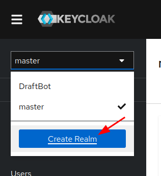
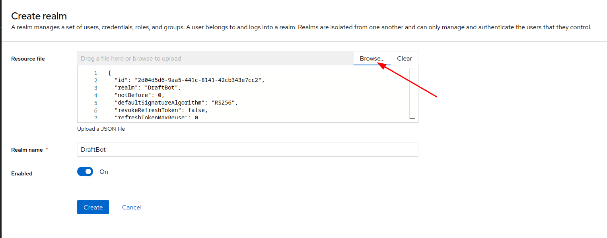
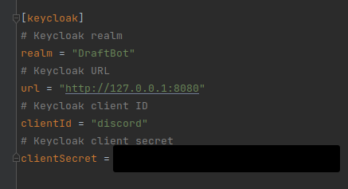

# Keycloak

Keycloak is the project used to authenticate users on Crownicles

## Start with docker

You can start Keycloak with docker using the following command:

```bash
docker-compose up -d
```

You can find the docker-compose file here:
[docker-compose.yml](./docker-compose.yml) 

## Configuring a realm

Visit http://127.0.0.1:8080/admin/master/console/ (Default credentials are admin/admin)

First click on the create realm button:



Import the already configured realm: [realm.json](realm.json):



Configure your Discord config.toml:

You will need to regenerate a client secret here on keycloak:

Manage -> Clients -> discord -> Credentials -> Client Secret -> Regenerate

